# 3D打印机（拓竹）使用方法

写在前面的话：

&emsp;&emsp;此教程并非仅针对拓竹 P1S 3D打印机进行讲解，Bambu Studio切片软件使用过程同样适用于其他切片软件，只在一些特殊技术设置上存在差别。若有同学对相关技术感兴趣，十分欢迎你来做客探讨。

&emsp;&emsp;拓竹的3D打印机具有一定的代表性，由于拓竹的创新性，让很多国产3D打印机更加好用，也更加便宜，使普通人加工制造的门槛大大降低。

## 1 工艺背景

### 1.1 减材制造与增材制造

**（1）减材制造：**

&emsp;&emsp;减材制造是指利用刀具将**毛坏**上多余的材料**去除**来制作工件的方法。

**（2）增材制造：**

&emsp;&emsp;增材制造（Additive Manufacturing，AM）技术是采用材料**逐渐累加**的方法制造实体零件的技术，相对于传统的材料去除－切削加工技术，是一种“**自下而上**”的制造方法。

### 1.2 增材制造的分类

&emsp;&emsp;增材制造按工艺分类可以分为7类：其中较为常见的是熔融沉积技术(FDM)、立体光刻技术(SLA)、选择性激光烧结技术(SLS)、选择性激光熔化技术(SLM)、金属粘合剂喷射技术(MBJ)等。

    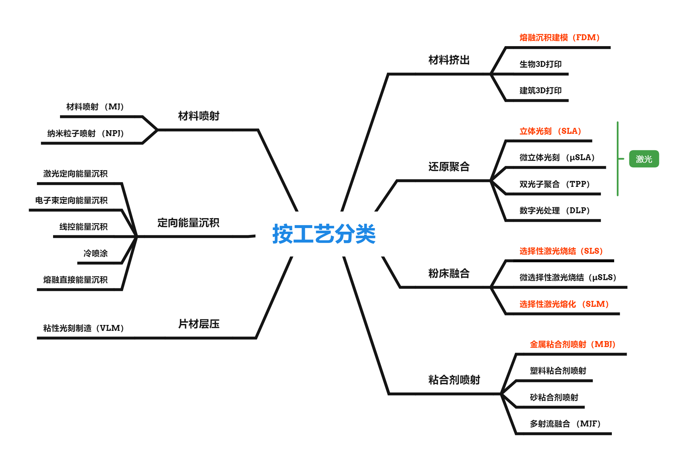

**（1）熔融沉积技术(FDM):**

&emsp;&emsp;FDM技术制造的模型需后续进行打磨操作，若不进行打磨，层纹明显，影响美观度，但设备简单，无需其他设备配合即可进行制造。

    
    

**（2）立体光刻技术(SLA):**

&emsp;&emsp;SLA技术制造的模型表面质量较好，光滑细腻，但所用原材料树脂为毒性材料，在制造时需进行二次固化且制造环境应具备排风系统，即需要多设备配合。

    
    

## 2 FDM打印机结构拆解

### 2.1 FDM打印机分类

&emsp;&emsp;在增材制造技术的不断发展中，诞生了多种结构的FDM打印机，大致可以分为6类。

    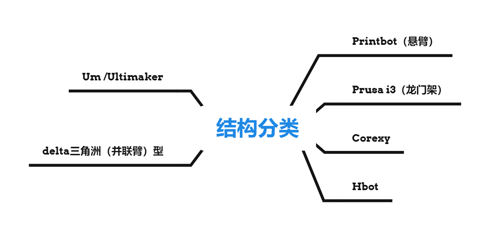

&emsp;&emsp;其中最为常见的是Printbot悬臂结构与Prusa i3龙门架结构，结构简单，造价很低，其中该图所示的悬臂结构DIY造价仅约为580元。

    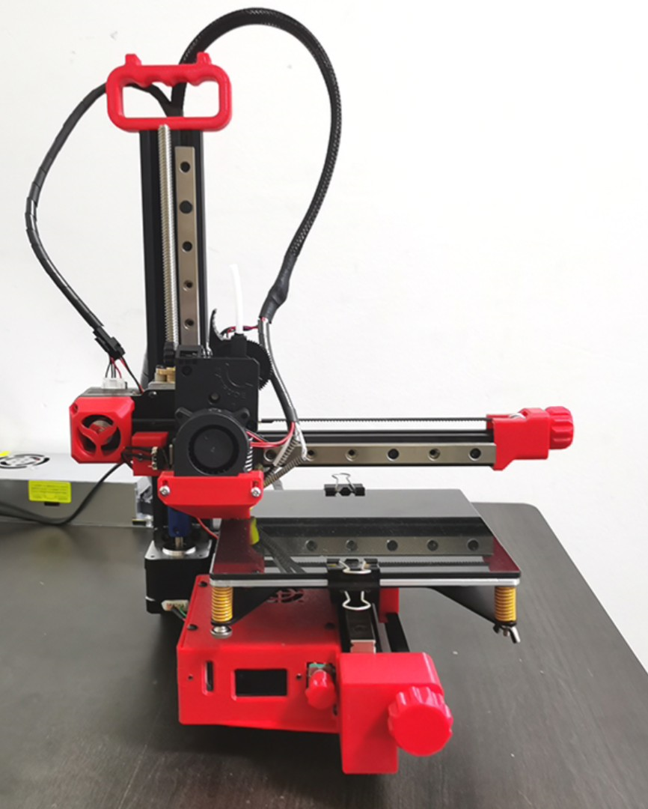
    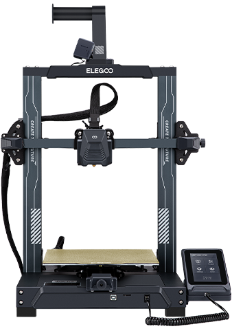

&emsp;&emsp;进一步的，Corexy结构和Hbot结构被常规消费者认为是具有超越上两种结构稳定性的优良性能。

&emsp;&emsp;因为这两种结构通过两个电机同时控制运动平台的移动，一个电机控制X轴方向，另一个电机控制Y轴方向。这种协同工作方式使得这两种结构在运动控制上更为稳定和精确。

    

&emsp;&emsp;Um结构虽然可以使打印效果有所提升，但由于装配较为复杂并不为广大消费者所接受。

&emsp;&emsp;其常与Corexy结构和Hbot结构进行对比，UM结构主要体现在打印头采用的是十字结构，因其挤出电机不在喷头端，能够有效的减轻3D打印头的重量，进而显著提升内部空间的使用率，两根光轴的固定使打印时的速度和精度都更为稳定，但双光轴更换配件比较麻烦，装配十分困难。

    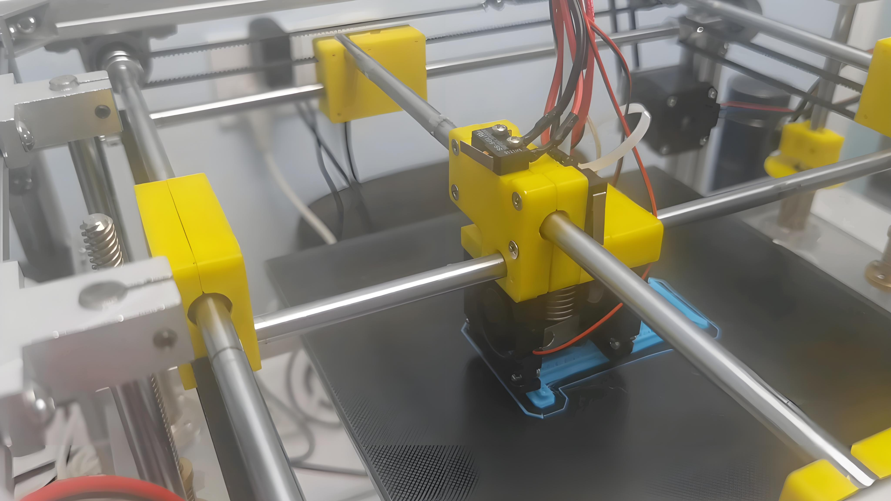

&emsp;&emsp;而delta三角洲结构，或称为并联臂结构，被誉为现今增材制造熔融沉积技术类目中，性能最为优良的且最具研究前景的打印机构型，基于此打印机构型可进一步研究类比于常规机床的多轴打印技术，但造价高昂、控制复杂、维修困难，仍无法成为消费级打印机的首选构型。

    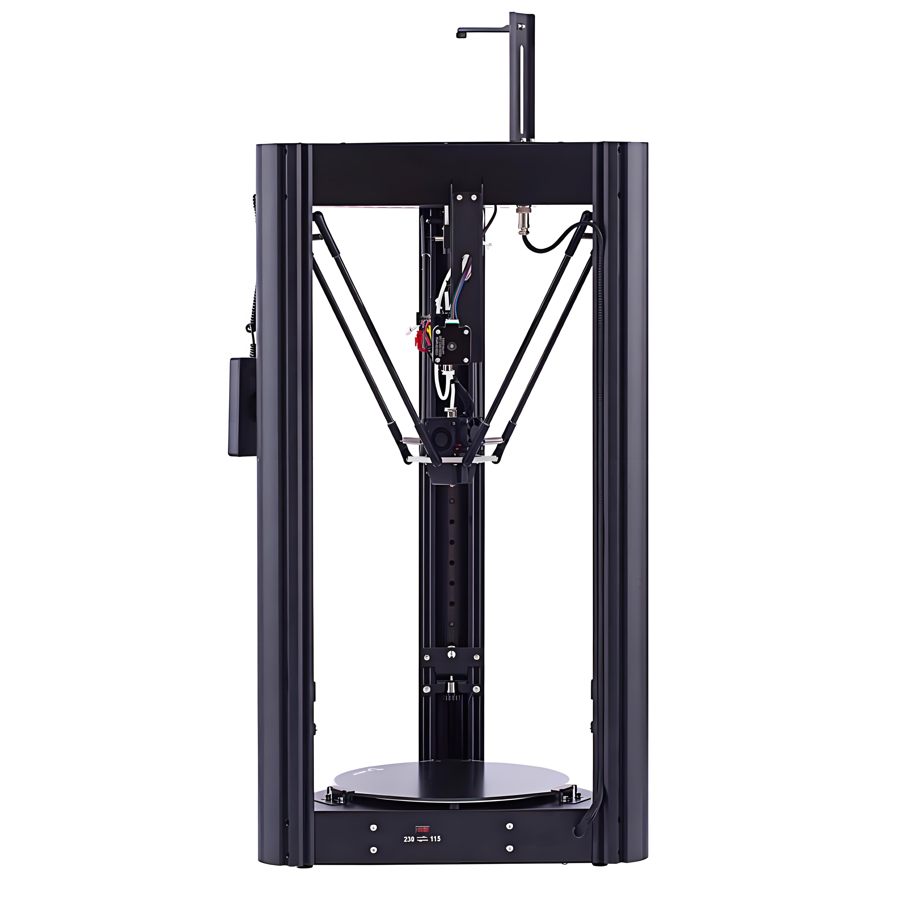

### 2.2 FDM打印机结构组成

#### 2.2.1 机架

&emsp;&emsp;机架常由铝合金材料制成，其包含全部用来金属外框、平移杆等零件。其功能在于对整体结构进行稳定限位并保证挤出机或打印平台可以在水平位置和竖直位置上移动。

    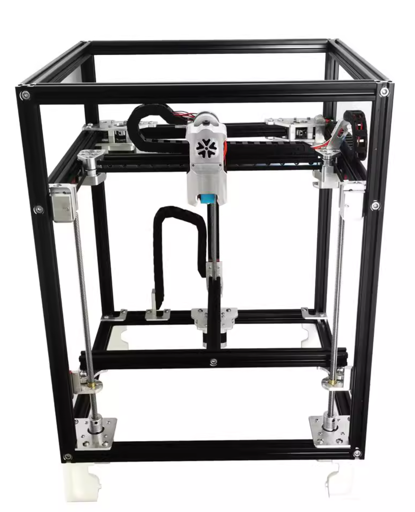

#### 2.2.2 供料系统

**（1）打印材料**

&emsp;&emsp;打印材料作为3D打印的原料，依据制造实物的用途不同可分为以下常用几类，FDM技术最常用的材料为各种合成塑料，将其融化为流体后便于堆叠成型。

    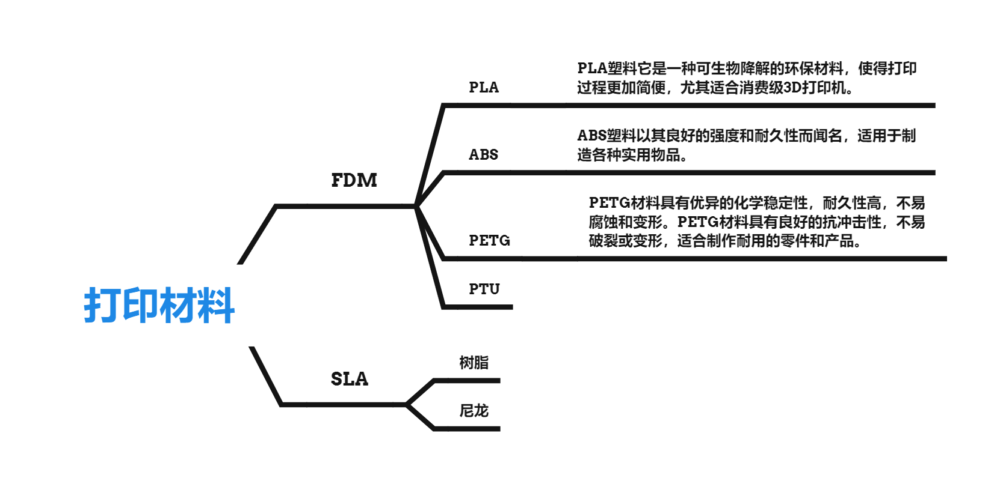

1）PLA材料：

&emsp;&emsp;PLA材料是3D打印消费者中最为常用的材料，全称为聚乳酸（Polylactic Acid，简称PLA），是一种以乳酸为主要原料聚合得到的聚酯类聚合物。它是一种新型的生物降解材料，具有许多优点，同时也存在一些缺点。

&emsp;&emsp;PLA材料的主要特点包括：

&emsp;&emsp;&emsp;&emsp;a.生态环保：PLA材料是由天然植物淀粉经过酸解聚合而成的生物塑料，相比传统塑料更加环保，可降解，对环境污染较小。

&emsp;&emsp;&emsp;&emsp;b.易于加工：PLA材料具有良好的加工性、熔融性和流动性，易于3D打印。其打印参数和打印温度可以调节，以提高粘附性、稳定性和打印成功率。

&emsp;&emsp;&emsp;&emsp;c.卫生安全：PLA材料遵循食品级原料生产要求，可以用于生物医学和食品包装领域，对人体健康影响较小。

&emsp;&emsp;&emsp;&emsp;d.**缺点**：PLA材料在高温环境下容易变形甚至熔融，强度和韧性较差，相比ABS材料在承重和弹性要求较高的应用中表现不佳。此外，PLA材料的价格较高，可能会增加生产成本和使用成本。

2）ABS材料：

&emsp;&emsp;ABS（丙烯腈-丁二烯-苯乙烯）是一种常见的热塑性聚合物材料。它因其优良的机械性能、耐化学性和易加工性而被广泛应用。

&emsp;&emsp;ABS材料的主要特点包括：

&emsp;&emsp;&emsp;&emsp;a.高冲击强度：ABS具有出色的抗冲击性能，能够承受较大的机械应力。

&emsp;&emsp;&emsp;&emsp;b.良好的热稳定性：在较宽的温度范围内保持其物理性质和机械强度。

&emsp;&emsp;&emsp;&emsp;c.优良的机械性能：包括高刚性和强度，使其适用于需要承受机械应力的应用。

&emsp;&emsp;&emsp;&emsp;d.良好的化学抗性：对多种化学物质（如酸、碱和油）具有良好的抵抗力。

&emsp;&emsp;&emsp;&emsp;e.易加工性：ABS易于成型和加工，包括注塑成型、挤出成型和3D打印等工艺。

&emsp;&emsp;&emsp;&emsp;f.**缺点**：ABS材料在长期暴露于阳光下可能会降解，因此通常需要添加紫外线稳定剂来提高其耐候性。而且ABS是一种可燃材料，在某些应用中需要采取防火措施。

3）PETG材料：

&emsp;&emsp;PETG（聚对苯二甲酸乙二醇酯共聚物）是一种改进型的PET（聚对苯二甲酸乙二醇酯）材料，具有许多优良的物理和化学性能，使其在各种应用中得到广泛使用。在消费者使用中公认PETG材料制成的较于PLA材料制成的实物保存时间更长。

&emsp;&emsp;PETG材料的主要特点包括：

&emsp;&emsp;&emsp;&emsp;a.高透明度：PETG具有出色的透明性，可以制成光学透明材料，广泛用于需要高透明度的应用。

&emsp;&emsp;&emsp;&emsp;b.优良的韧性和强度：相比于普通的PET，PETG具有更高的冲击强度和韧性，能够承受较大的机械应力。

&emsp;&emsp;&emsp;&emsp;c.易加工性：PETG材料易于加工，可以通过注塑、挤出和吹塑等方法成型，且在加工过程中不会产生有害物质。

&emsp;&emsp;&emsp;&emsp;d.耐化学性：PETG对多种化学品（如酸、碱和油）具有良好的抵抗力。

&emsp;&emsp;&emsp;&emsp;e.耐候性：PETG材料具有良好的耐候性，能够在户外环境中保持性能。

&emsp;&emsp;&emsp;&emsp;f.低吸湿性：PETG的吸湿性较低，能够在高湿度环境中保持稳定的尺寸和性能。

&emsp;&emsp;&emsp;&emsp;g.可印刷性：PETG表面光滑，易于进行各种印刷和涂层处理。

&emsp;&emsp;&emsp;&emsp;h.**缺点**：PETG的熔点较低，加工过程中需控制好温度，以避免材料降解。虽然其具有较高的韧性，但表面相对较软，容易被划伤，因此在使用过程中还需注意保护表面。在高温下，改材料可能会变形或性能下降，因此也不适用于长期高温环境。

4）PTU材料：

PTU（聚硫醚，Polyphenylene Sulfide, PPS）是一种高性能热塑性工程塑料，因其优异的化学和热性能广泛应用于许多领域，常用于制作柔性模型。

&emsp;&emsp;PTU材料的主要特点包括：

&emsp;&emsp;&emsp;&emsp;a.高温性能：PTU材料能够在高温环境中保持其物理和机械性能，耐热性能极佳，使用温度范围通常在-196°C到260°C。

&emsp;&emsp;&emsp;&emsp;b.化学耐受性：对许多化学物质如强酸、强碱和有机溶剂具有出色的抵抗力。

&emsp;&emsp;&emsp;&emsp;c.机械强度：具有高强度和刚性，同时在高温环境中仍能保持良好的力学性能。

&emsp;&emsp;&emsp;&emsp;d.电绝缘性：在广泛的温度和湿度范围内都具有良好的电绝缘性能。

&emsp;&emsp;&emsp;&emsp;e.耐磨性：具有很好的耐磨损性能，适合用于摩擦和磨损环境。

&emsp;&emsp;&emsp;&emsp;f.尺寸稳定性：低吸湿性和低热膨胀系数，使其具有良好的尺寸稳定性。

&emsp;&emsp;&emsp;&emsp;g.**缺点**：PTU材料在加工过程中需要精确的温度控制和特殊的设备，因为其熔点高，加工难度较大。而且PTU材料的成本相对较高，只适用于高性能要求的应用领域。

**（2）挤出机**

&emsp;&emsp;挤出机是3D打印技术中非常重要的组件，它负责将打印材料（通常是塑料丝或其他热熔材料）挤出，并通过挤出头熔融进而挤出到热床上，逐层构建出三维物体。其中根据挤出机中挤出电机与挤出头的位置关系，可以将其分为2类：直接驱动挤出机（近程挤出机）和远程驱动挤出机（远程挤出机）。

    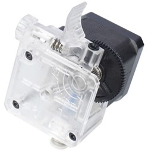

&emsp;&emsp;1）直接驱动挤出机（Direct Drive Extruder）：

&emsp;&emsp;驱动电机和挤出头直接相连，具有较高的进料精度和响应速度，适合打印柔性材料。但由于电机与挤出头距离较近，使得挤出机本身因移动而产生的惯性力较大，因此在打印中会出现打印精度交叉等问题。现今主要的解决方案是进行共振校准，通过算法进行共振补偿。

&emsp;&emsp;2）远程驱动挤出机（Bowden Extruder）：

&emsp;&emsp;驱动电机和挤出头通过长管道连接，重量较轻，适合高速打印，但对柔性材料支持较差，也极易发生挤出不均匀的情况。

&emsp;&emsp;**（3）挤出头**

&emsp;&emsp;挤出头作为与挤出机相配合的重要零件，负责将打印材料（通常是塑料丝）加热并挤出，常用材质为黄铜，导热较快，且具有多种挤出尺寸，最为常用的为0.4mm。

    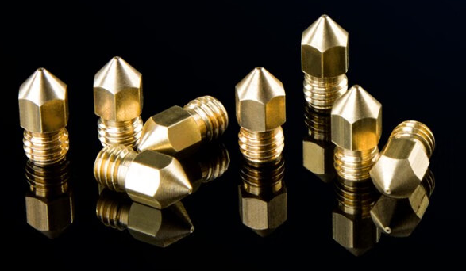

#### 2.2.3 动力系统

**（1）电机**

&emsp;&emsp;电机作为整体3D打印机运动的实现者，由控制板上的电机控制模块进行转速的调节，经由同步带将自身旋转运动转化为挤出机和热床的水平及竖直运动，最为常用的为42步进电机。

    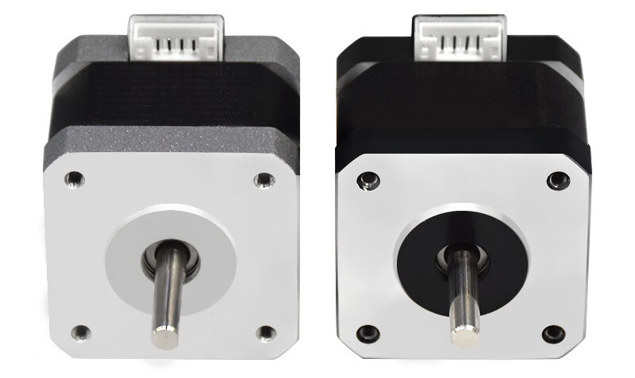

**（2）风扇**

&emsp;&emsp;因封闭式3D打印机对热量的耗散是可以通过调节风扇大小进行控制，所以封闭式3D打印机的打印性能会优于开放式3D打印机，所以风扇的使用是必不可少的。如何构建合理且高效的风冷系统也成为了现今3D打印机的热门话题之一。

    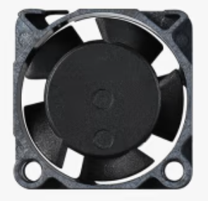

#### 2.2.4 热床系统

**（1）热床**

&emsp;&emsp;热床的主要功能是提供一个加热的平台，以帮助打印对象更好地粘附在打印床上，并防止翘边和变形。热床最为常用的材料为铝基板材料，具有良好的导热性能。

&emsp;&emsp;热床在打印开始前要进行调平操作，该操作可分为2种操作方式：手动调平与自动调平。

&emsp;&emsp;最为简单的手动调平及通过挤出头与热床四角点位与中心点位检测后，经由拧动热床下方调节高度的螺栓进行手动调节。现如今，自动调平技术已经基本成为了各种3D打印机的标配功能，从最初的5点检测，到现今的8*8=64点检测，通过算法对挤出头进行补偿，使得热床作为打印平台更加接近相对水平，更有利于模型的堆叠。

&emsp;&emsp;如若模型出现翘边、变形的情况，一般在前10层内就可以大致看出端倪，可及时停止打印防止浪费打印材料，可尝试升高温度，也可在打印平台上贴美纹纸或用固体胶、专用胶水等方式对底层进行固定。

    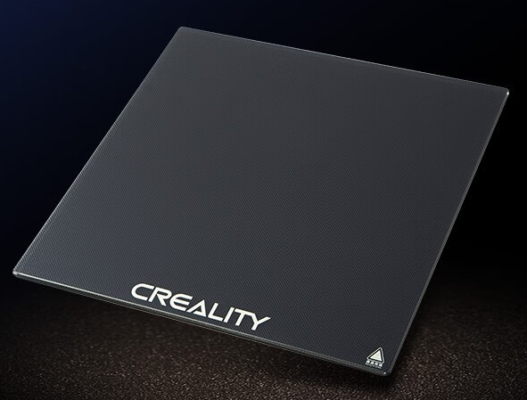

&emsp;&emsp;温度设置（经验设置）：

|  材料  |   温度   |
|  :--: |:-------: |
|  PLA  |  50-70°C |
|  ABS  | 90-110°C |
|  PETG |  70-90°C |
|  TPU  |  40-60°C |

**（2）打印板**

&emsp;&emsp;为应对不同的打印材料和用途，打印板可主要分为4类。

    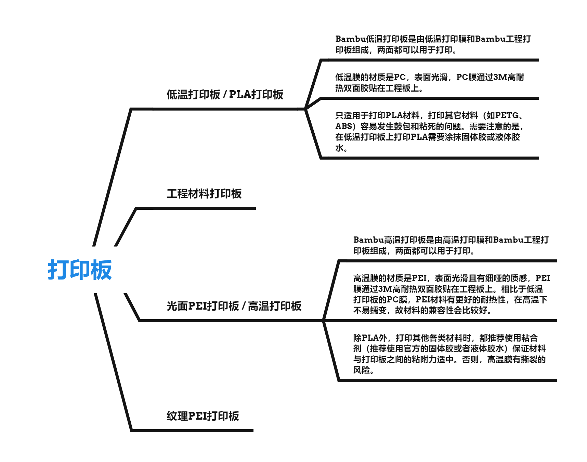

&emsp;&emsp;其中最为常用的为纹理PEI打印板，PEI（聚醚酰亚胺）是一种高性能的热塑性工程塑料，具有优异的机械、热和化学性能。

    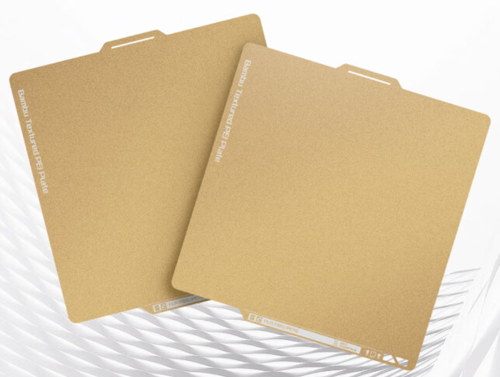

#### 2.2.5 控制系统

&emsp;&emsp;控制系统作为3D打印机的大脑，负责控制挤出头的挤出、移动等运动，通过识别切片后的G-code（数控机床专用代码）对3D打印机一切物理量（挤出头温度、风扇速度、热床温度、材料的断续等）进行把控和反馈。常为STM32嵌入式芯片进行开发而成。

    

## 3 拓竹3D打印机设备使用方法

### 3.1 设备介绍

&emsp;&emsp;[Bambu Lab 深圳拓竹科技有限公司](https://www.bambulab.cn/zh-cn)是一家致力于用前沿的机器人技术彻底革新桌面级 3D 打印产业的公司。拓竹科技的第一款产品——X1 系列高速智能 3D 打印机瞄准业内最强性能，在诸多关键性能上，实现了数量级上的进步，更是把多色彩打印、支持高性能工程塑料等工业级打印机技术带入消费级产品，拉开了业界期待多年的桌面 3D 打印革命的序幕。用户在打印过程中能够突破色彩和材料的限制，将创造力提升到了一个全新的水平，找到纯粹的创造乐趣。拓竹科技成立于 2020 年，总部位于中国深圳，在深圳和上海设立了研发中心，并在美国奥斯汀设立办公室。

    

&emsp;&emsp;[Bambu A1 mini](https://item.jd.com/10085836739926.html)是一款入门级桌面3D打印机，外观设计简约优雅，银灰色配色搭配悬臂式结构，占地面积仅略大于 A4 纸，十分节省空间。它的最高打印速度可达 500mm/s，成型尺寸为 180x180x180mm，打印精度较高，每次打印前会自动进行参数检测和补偿。喷头与热端采用近程挤出和双齿轮设计，默认安装不锈钢喷嘴，热端为快拆式设计，还具备主动流量补偿功能。操作方面，搭载2.4英寸触摸屏，支持 Wi-Fi、蓝牙、Micro SD卡等多种连接方式，显示屏上有助手功能，出现错误会弹出警报提示并给出解决建议。此外，它内置摄像头，可实时监控和远程操作，还支持延时摄影，工具头上配备缠材监测传感器，可选配件AMS lite是耗材切换多色系统。总之，拓竹 A1 mini 性价比较高、功能齐全，适合初学者、个人爱好者以及对空间和预算有要求的用户。

    

&emsp;&emsp;继去年11月份上线的Bambu Lab P1P后，拓竹科技于2023年7月13日正式发布了升级款P1S，这是一款全封闭式CoreXY高速3D打印机。和P1P一样，[Bambu Lab P1S](https://item.jd.com/10080033613061.html#crumb-wrap)同样是一台组装好的整机，快速开箱，只需15分钟即可完成。它的最高打印速度可达500mm/s，并具有20,000mm/s2的加速度，只需18分钟24秒就能快速而优质地打印出测试船Benchy。此外，P1S还可选配自动供料系统AMS，使用户能够打印多达16种颜色。

    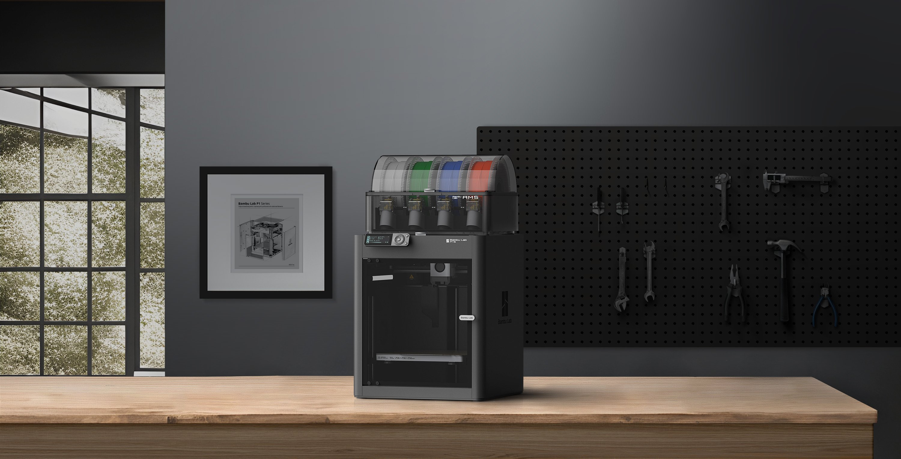

### 3.2 涉及文件后缀

**（1）.stl**

&emsp;&emsp;STL (STereoLithography, 立体光刻)是由3D Systems软件公司创立、原本用于立体光刻计算机辅助设计软件的文件格式。许多套装软件支持这种格式，它被广泛用于快速成型、3D打印和计算机辅助制造(CAM)。STL文件仅描述三维物体的表面几何形状，没有颜色、材质贴图或其它常见三维模型的属性。STL格式有文字和二进制两种型式。二进码型式因较简洁而较常见。

&emsp;&emsp;以crab模型为例，该模型在工程软件中如SW和UG可另存为stl格式的文件，工程软件会在使用者另存为时自动将模型转化为多三角形并输出相关信息让使用者进行确认。

&emsp;&emsp;从图中可以看出，共有513984个三角面组成了模型并通过二进制型式进行保存，保存后后缀名为.STL。

    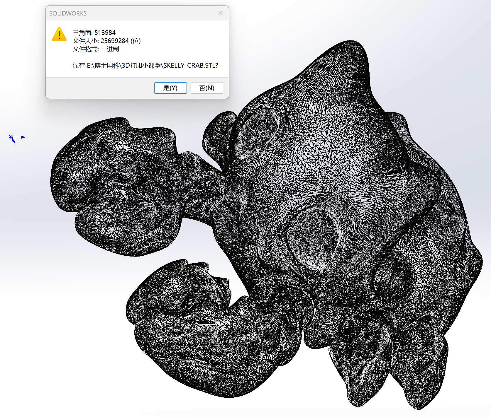

&emsp;&emsp;再次打开该stl文件，虽然外表看起来十分光滑，但放大后可以发现仍由三角面构成。

    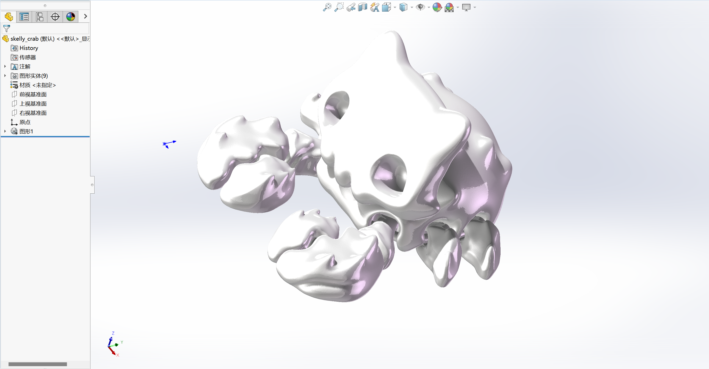
    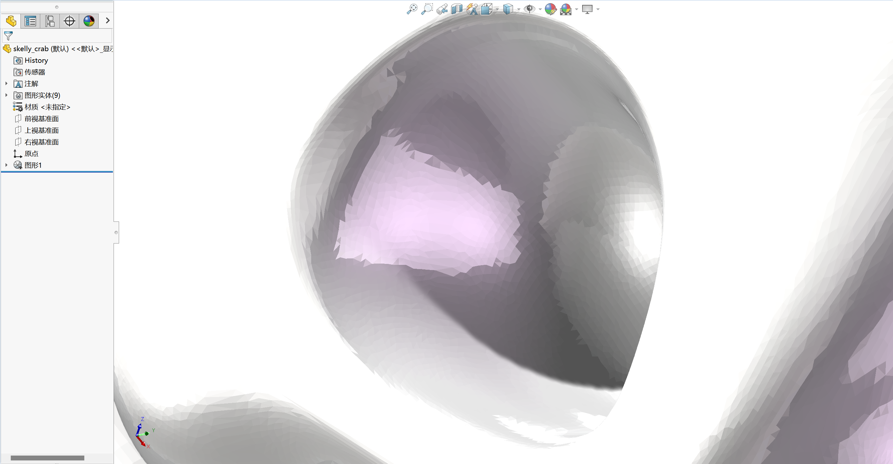

**（2）.gcode**

&emsp;&emsp;G代码（G-code，又称RS-274），是最为广泛使用的数控（Numerical Control）编程语言，有多个版本，主要在计算机辅助制造中用于控制自动机床。G代码有时候也称为G编程语言。使用G代码可以实现快速定位、逆圆插补、顺圆插补、中间点圆弧插补、半径编程、跳转加工等操作。因此也常用于3D打印机的切片编程中，切片后后缀名为.gcode。

    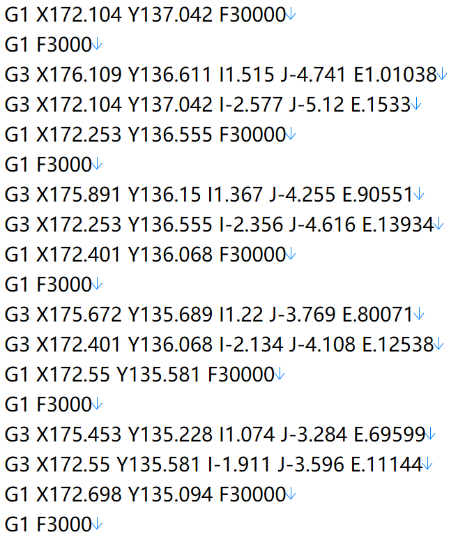

**（3）.3mf**

&emsp;&emsp;3mf（3D Manufacturing Format）格式的发展由3MF联盟推动，该联盟由微软于2015年4月底主导创立，由多家3D打印相关公司组成，包括Stratasys、3D Systems、SLM、UltiMaker、Shapeways、Materialise，Autodesk、惠普等。3MF格式能够更完整地描述3D模型，除了几何信息外，还可以保持内部信息、颜色、材料、纹理等其它特征。相比于AMF，3MF是一种更理想同时获得行业认可度更高的3D打印文件格式。

    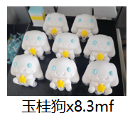

### 3.3 拓竹P1S切片控制软件操作介绍

#### 3.3.1 切片控制软件下载

&emsp;&emsp;由于拓竹P1S具有WIFI连接的功能，使得远程控制成为了可能，无需经由SD卡将G代码传输至3D打印机。切片控制软件可通过PC与手机对拓竹P1S进行控制，前期应在[拓竹官方下载网站](https://bambulab.com/en/download)进行下载安装与注册。下载设置完成后，便可像代码管理一样管理3D打印项目，即形成3mf文件。

    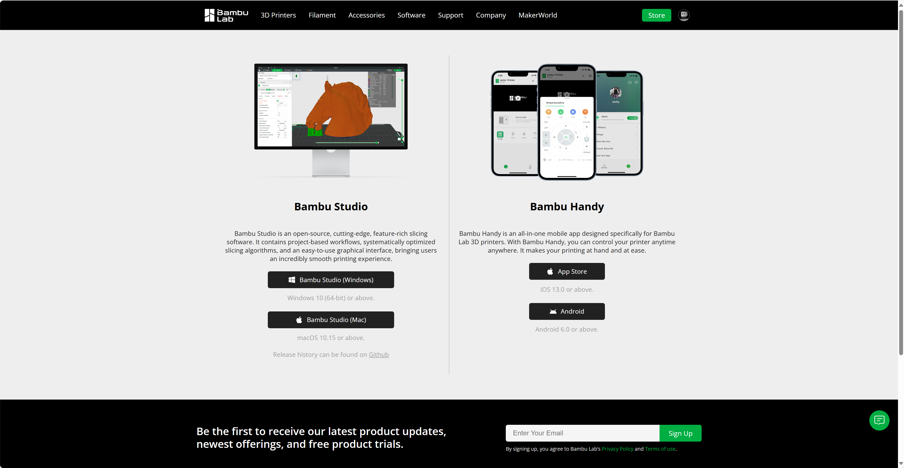

&emsp;&emsp;其中，左侧为PC端软件打开界面，右侧为手机端软件。

    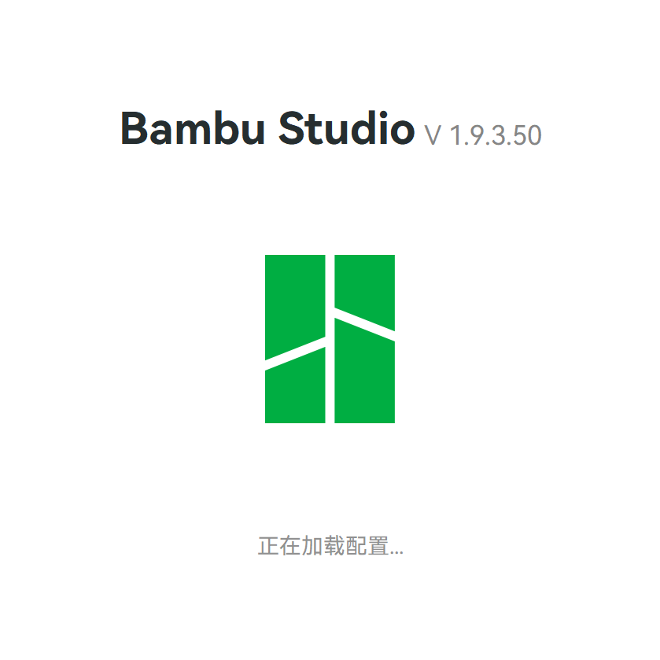
    

#### 3.3.2 顶部操作栏介绍

&emsp;&emsp;开启新项目后即可进入准备界面，在准备界面中部上方操作栏发现用“∣”进行分割的3部分，其中，最左侧为对整体全局进行的操作，中部为对单一模型进行的操作，最右侧则为进入装配图视图界面操作。

    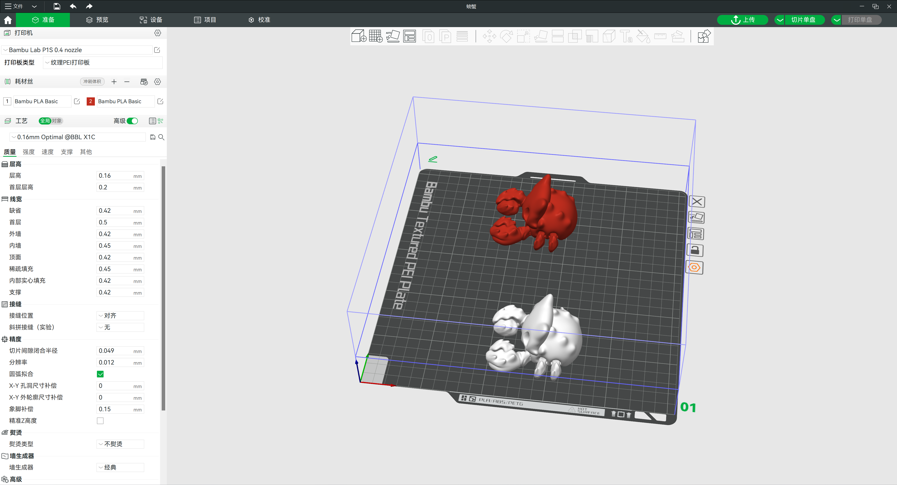

&emsp;&emsp;对整体全局进行的操作从左至右较为常用的为前4个：添加、添加新盘、自动朝向和全局整理。

    
    
    
    

&emsp;&emsp;而当用鼠标点击单一模型时，中部对单一模型进行的操作图标便会亮起。同时，模型被方框线框选，右下角出现该模型信息。

&emsp;&emsp;从模型信息可以看出该模型的名称、大小、体积与三角形数量，可以发现，该三角形数量与另存为时工程软件所切分的数量相同，皆为513984个。

    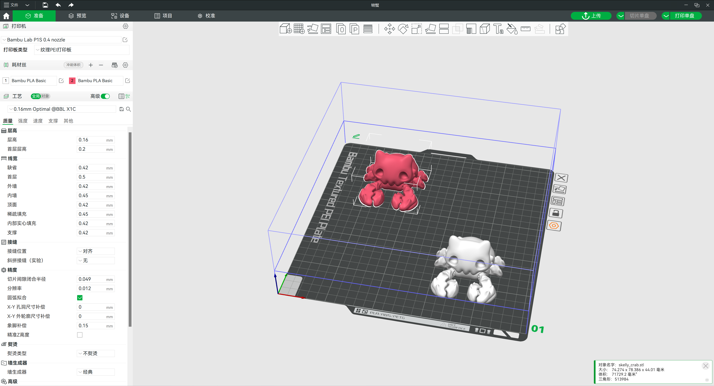

&emsp;&emsp;中部对单一模型进行的操作从左至右较为常用的为前4个：移动、旋转、缩放与选择底面。

    
    
    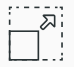
    

#### 3.3.3 左侧设置栏介绍

&emsp;&emsp;观察左侧设置栏，共有三种设置，分别为打印机设置、耗材丝设置与工艺设置。其中，工艺设置重点的全局与对象分类与顶端操作栏相同。

    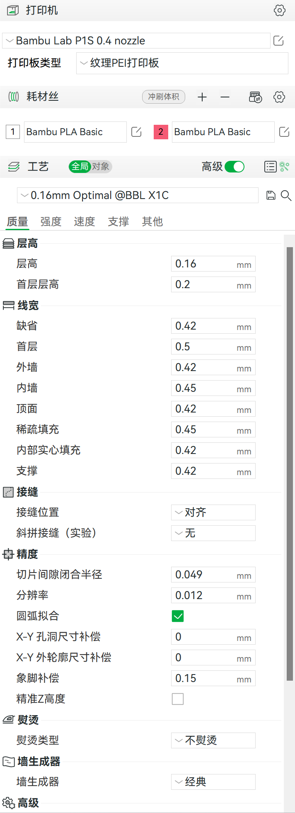

**（1）打印机设置**

&emsp;&emsp;打印机设置主要是选取设备的型号，不同的设备具有不同的打印空间且控制方法各有不同。若打印机设置与传输后打印机不符合则会在打印界面出现<a id="所选打印机（P1S）与切片软件中选择的打印机配置文件（A1）不兼容。"> “**所选打印机（P1S）与切片软件中选择的打印机配置文件（A1）不兼容。**” </a>的报错内容

&emsp;&emsp;打印板设置则是对使用的打印版进行选择，这将决定着热床的温度，进而决定打印质量。

    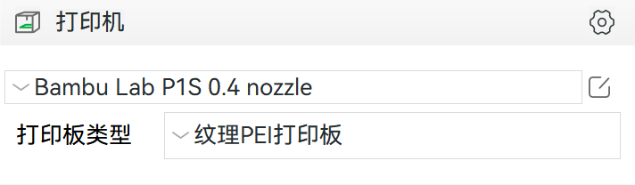

    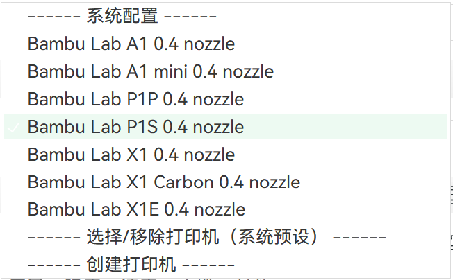
    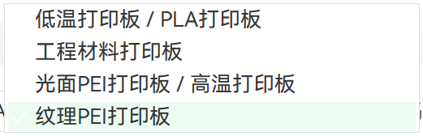

**（2）耗材丝管理**

&emsp;&emsp;耗材丝管理在后续<a href="#多色打印"> 多色打印 </a>会详细介绍。

**（3）工艺设置**

&emsp;&emsp;工艺设置最初可选择系统预设好的工艺，将鼠标放置于工艺上可以看到系统对该工艺的介绍，进而根据自身需求进行选择。

    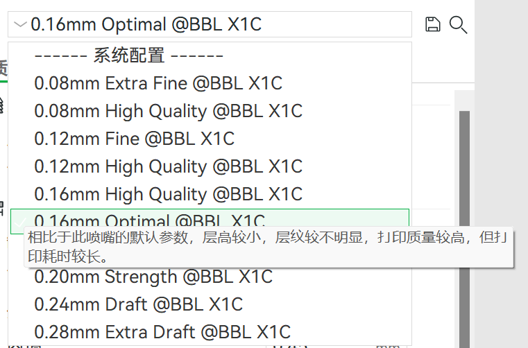

&emsp;&emsp;工艺设置参数较多，共有5个设置分类，从左到右依次为：质量设置、强度设置、速度设置、支撑设置与其他设置。

    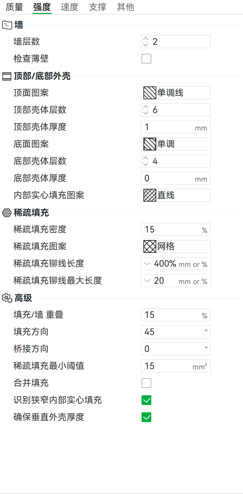
    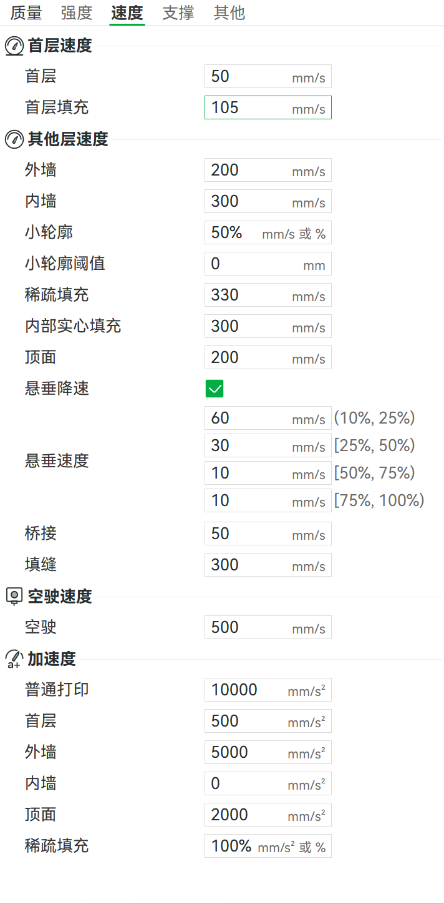
    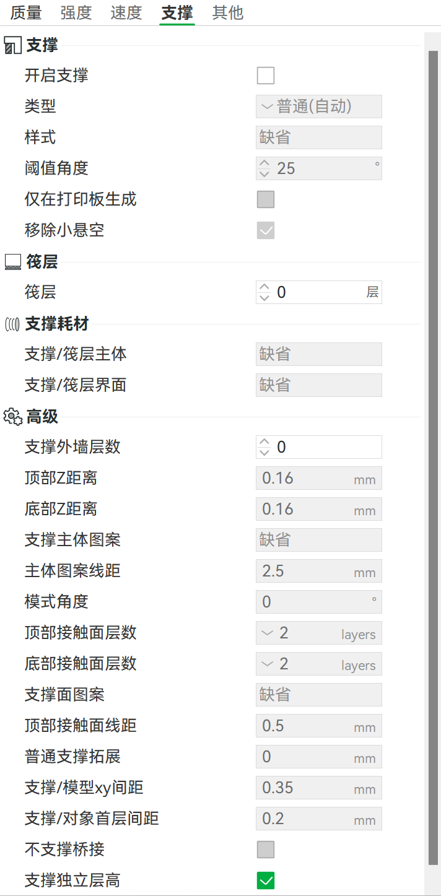
    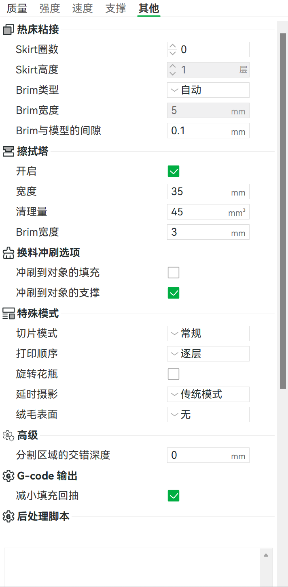

&emsp;&emsp;其中较为常用的工艺设置主要为3个： 强度设置中的稀疏填充设置、支撑设置中的支撑设置与其他设置中的擦拭塔设置。

&emsp;&emsp;1）稀疏填充设置（强度设置）

&emsp;&emsp;&emsp;&emsp;稀疏填充设置主要修改参数为稀疏填充密度与稀疏填充图案，通过点击右上角切片单盘或直接点击左上角预览可对模型进行切片并进行逐层预览。

    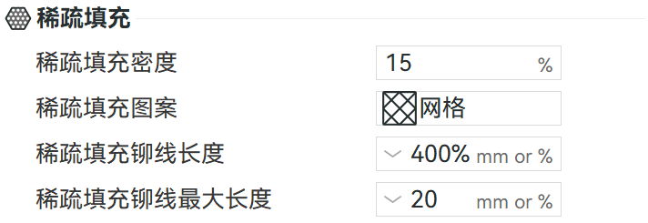

&emsp;&emsp;&emsp;&emsp;以crab模型为例，对该模型在稀疏填充密度0％、稀疏填充图案为网格图案，在稀疏填充密度15％、稀疏填充图案为网格图案以及在稀疏填充密度50％、稀疏填充图案为网格图案的条件下进行切片预览对比。

&emsp;&emsp;&emsp;&emsp;从图中可以看出，内部网格密度不断增大，但图案并未发生变化。

    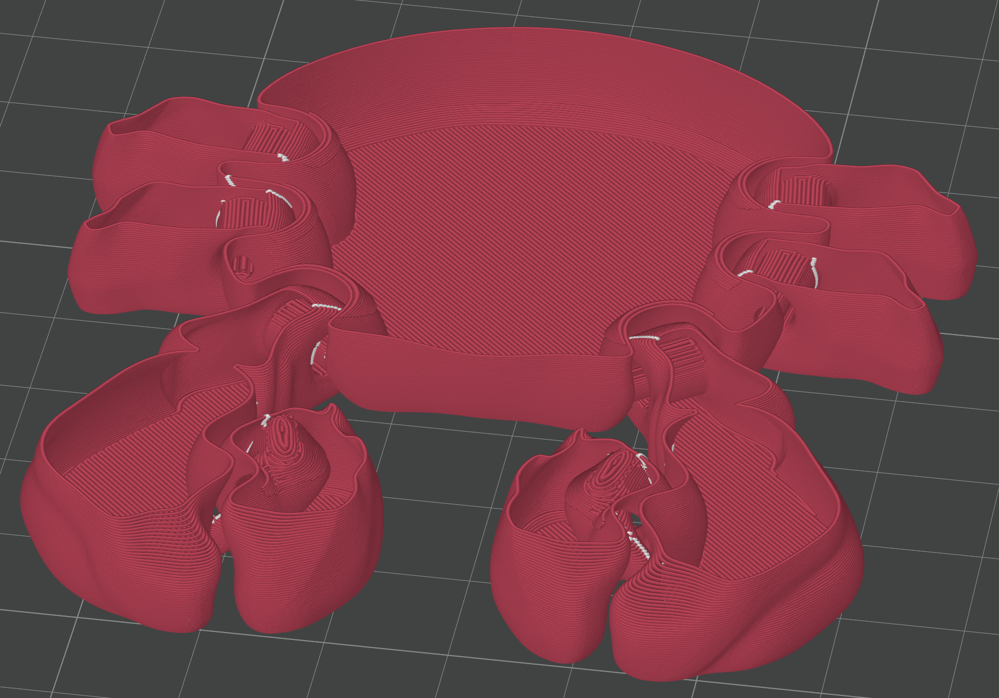
    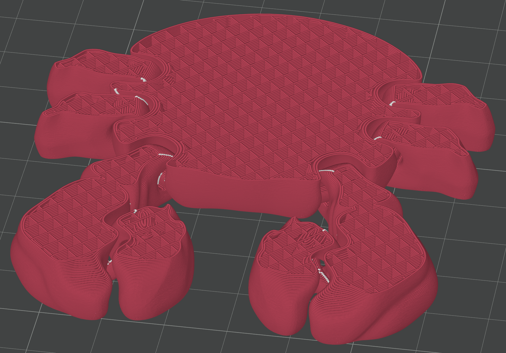
    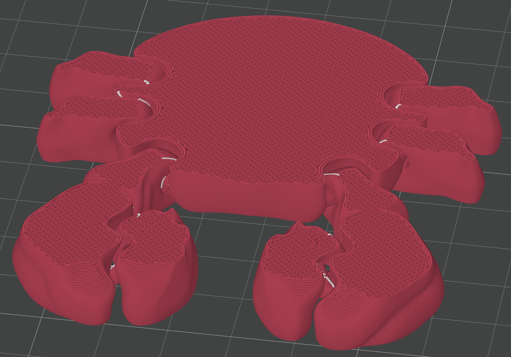

&emsp;&emsp;&emsp;&emsp;但如果进一步将稀疏填充密度增大至100％会出现<a id="网格 填充图案不支持100％密度。"> “**网格 填充图案不支持100％密度。**” </a>的报错内容，点击“是”即可解决。

    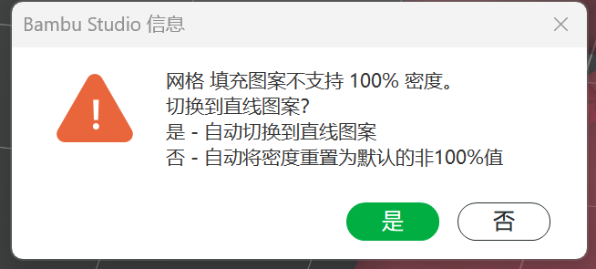

&emsp;&emsp;&emsp;&emsp;从图中可以看出，稀疏填充密度达到了100％但稀疏填充图案被切换至直线图案。

    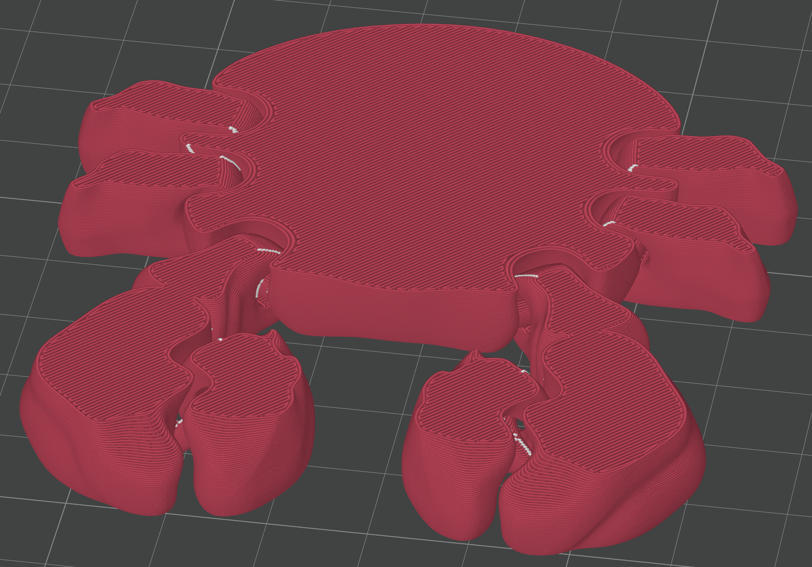

&emsp;&emsp;&emsp;&emsp;直线图案与网格图案是较为常用的两种稀疏填充图案。其他填充图案不在此介绍。

    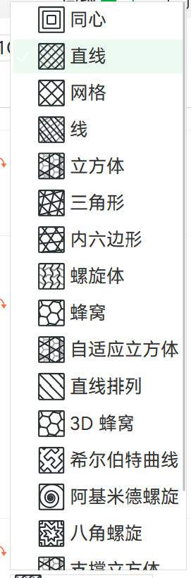

&emsp;&emsp;&emsp;&emsp;稀疏填充设置的更改可以进一步提升模型自身强度，但相对的，打印时间与消耗的耗材量也会上升，因此可以根据需要进行设置。

&emsp;&emsp;2）支撑设置（支撑设置）

&emsp;&emsp;&emsp;&emsp;支撑设置主要是对模型摆放后的悬空位置进行支撑，从而使得悬空位置得以正常打印。

&emsp;&emsp;&emsp;&emsp;以萝卜刀模型为例，从图中可以看出，很多摆放方法若从下至上打印，其悬空位置无法很好的成型，而且与热床平面接触较小，打印会失败。

    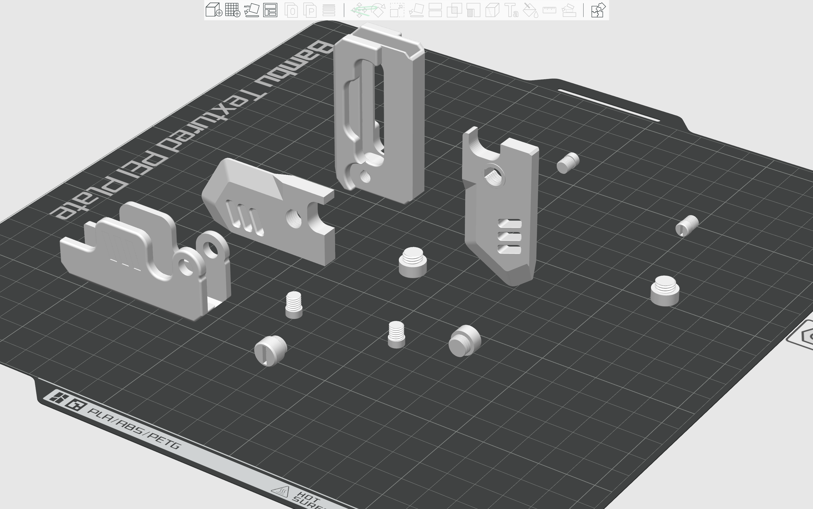

&emsp;&emsp;&emsp;&emsp;因此需对其进行加支撑设置。共有2种支撑：普通支撑与树状支撑。

    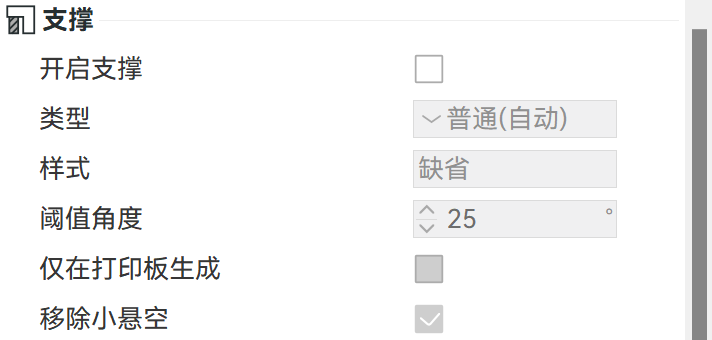
    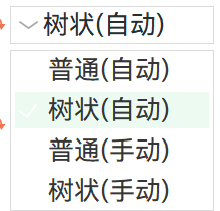

&emsp;&emsp;&emsp;&emsp;树状支撑是现如今较为流行的支撑方式，其运用拓扑学并结合二叉树的形成方式，从模型外侧对悬空平面进行打印支撑。该支撑方法因不像普通支撑那样与模型密切接触，使得模型表面打印质量得到极大提升。

    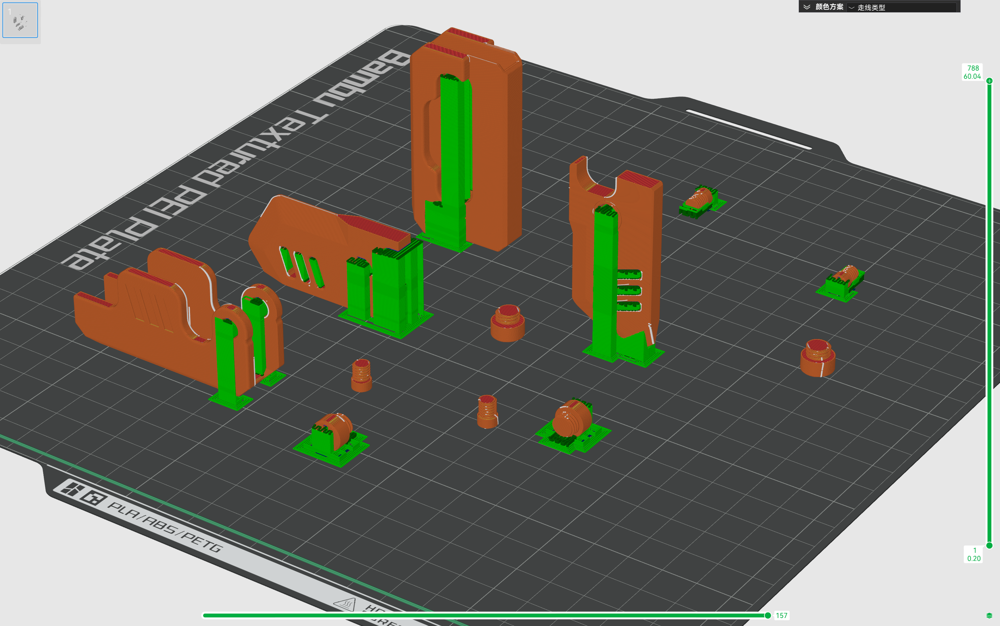
    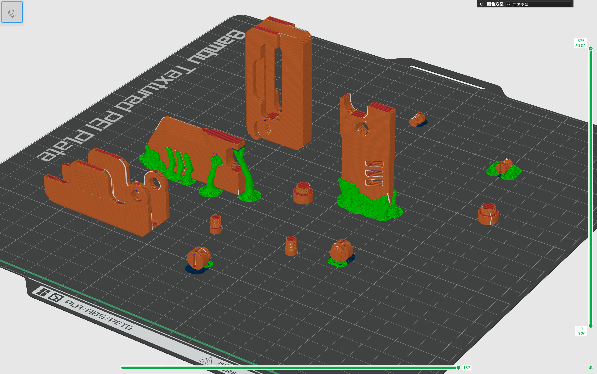

&emsp;&emsp;3）擦拭塔设置（其他设置）

&emsp;&emsp;&emsp;&emsp;擦拭塔与“竹屎”以及3D打印机在开始打印试时首先打印的一条折线本质相同，都是为了在使用新颜色耗材丝的时候将上一次打印残留在打印头中的耗材与新颜色耗材丝进行替换，防止打印中出现混色对模型表面颜色产生影响。

    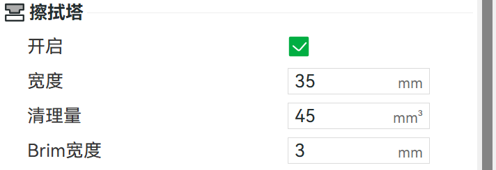

    
    
    

&emsp;&emsp;&emsp;&emsp;但擦拭塔与其他两种的存在条件有所区别，该设置主要用于多色打印。以玉桂狗模型为例，在同一平面下可以观察到同时存在黄色与白色两种颜色，因此需要在打印好白色部分后更换黄色部分继续打印，在更换中间在同一高度的擦拭塔上进行擦拭可以更为快速的进行更换，节省打印时间。

    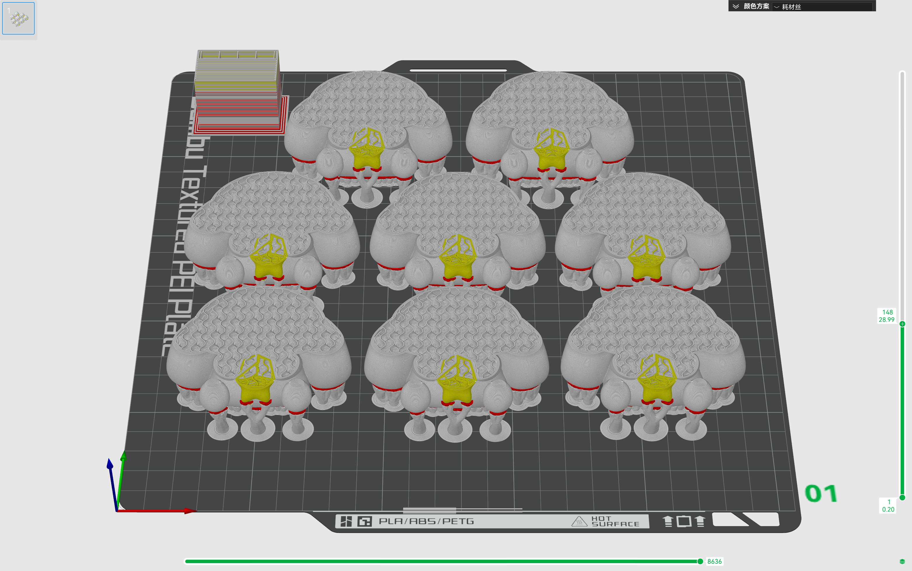

#### 3.3.4 进行打印

&emsp;&emsp;在做完全部设置并预览完成后可进行打印，点击右上角打印单盘后，会自动跳出确认界面。

&emsp;&emsp;以玉桂狗模型为例，在此确认界面，可以获得本次打印任务的时间信息、用料质量、打印机机型选择更有打印材料的选择。

    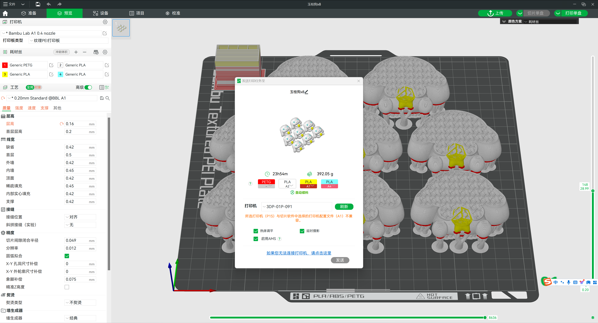

&emsp;&emsp;这可与前面耗材丝设置一并介绍，为应对<a id="多色打印"> 多色打印 </a>，在耗材丝设置处点击“+”可以增加耗材丝使用类型，并在其中选择使用者需要使用的耗材丝类型，可进行多类型、多颜色耗材丝的随意搭配，AMS耗材管理也为该设计思路提供了便利。

#### 3.3.5 设备监看

&emsp;&emsp;在发送打印后，会自动跳转至设备界面，同样的，手机端也可以进入设备界面进行打印监看。通过机箱内置的摄像头观察打印过程是否出现异常，如若出现异常可及时停止打印，避免对打印硬件的损害以及造成耗材丝的浪费。

    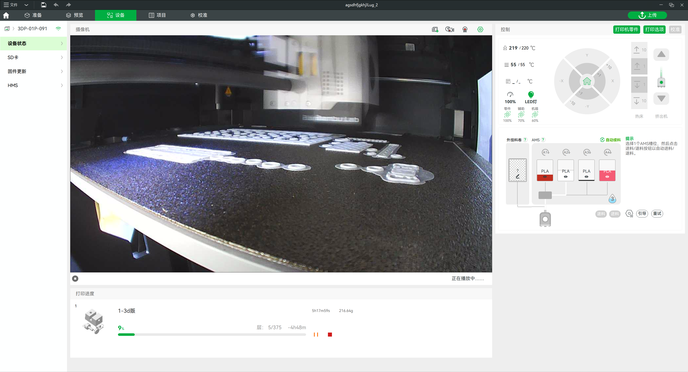
    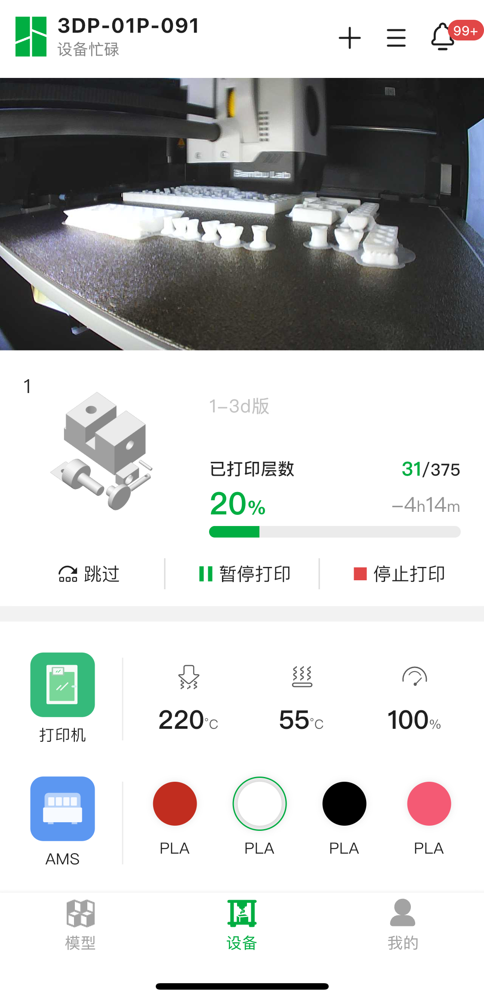

## 4 常见错误

（1）<a href="#所选打印机（P1S）与切片软件中选择的打印机配置文件（A1）不兼容。"> 所选打印机（P1S）与切片软件中选择的打印机配置文件（A1）不兼容。 </a>

（2）<a href="#网格 填充图案不支持100％密度。"> 网格 填充图案不支持100％密度。 </a>

（3）AMS助力电机过载，可能是因为耗材缠住或料盘卡住。（联系徐鹏进行维修）

    

## 5 拓竹3D打印机设备联系人

&emsp;&emsp;&emsp;&emsp;15114511742（徐化睿手机微信号）

&emsp;&emsp;&emsp;&emsp;1668385413@QQcom（徐化睿QQ邮箱）

&emsp;&emsp;&emsp;&emsp;瓯江实验室2号楼科思楼720

P.S：若出现报错可先联系徐化睿进行修正。光固化推荐[嘉立创3D打印网站](https://www.jlc-3dp.cn/)。

